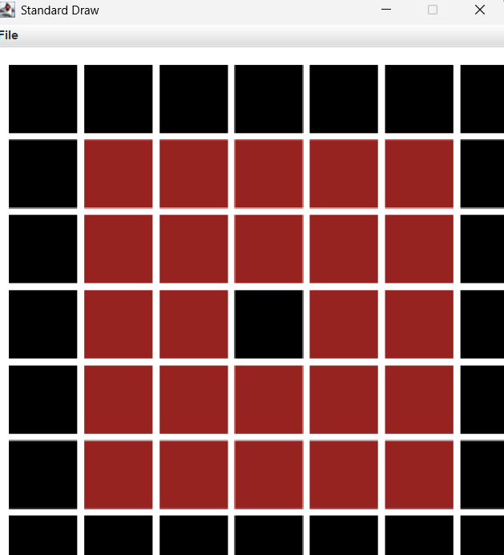

# I2CS_Ex2
המטלה השלישית במבוא לחישוב 
# I2CS_Ex2 – 

## מה יש בפרויקט?
מאגר זה מרכז את התרגילים, דוגמאות הקוד והבדיקות שסופקו במסגרת הקורס **מבוא למדעי המחשב (Intro2CS)**. הקוד כתוב ב‑Java ומחולק לפי תרגילי בית (Ex0–Ex2) ולפי שבועות הלימוד בכיתה.

## מבנה התיקיות
- `src/assignments/Ex0` – חימום ראשוני: מחלקות בסיסיות להפעלת בדיקות יחידה והיכרות עם מבנה פרויקט Java. כולל גרסאות פתרון לדוגמה בתיקיית `sol`.
- `src/assignments/Ex1` – עבודה עם פולינומים כמערכים: חישוב ערכי פונקציה, מציאת שורשים, השוואה, אינטגרציה נומרית ועוד. כולל מחלקת `StdDraw` לתצוגה גרפית פשוטה.
- `src/assignments/Ex2` – עבודה על מפות דו־ממדיות (רסטר) והפעלה גרפית:
  - `Map2D` (interface) ו־`Map` (מימוש) עבור פעולות ציור, שינוי קנה מידה, מציאת מסלול קצר, מילוי שטחים ועוד.
  - `Ex2_GUI` לטעינה/שמירה של מפות (`map.txt`, `Map 2.txt`) ולהצגה גרפית.
  - מחלקות עזר כגון `Pixel2D`, `Index2D` ו־`StdDrawTest` לתמיכה בבדיקות ושרטוט.
- `src/classes/week1`–`week9` – דוגמאות קוד משיעורי הכיתה: חישובי GCD, עבודה עם מערכים, מבני נתונים, גאומטריה חישובית ועוד.
- `src/TA` – שאלות ותרגולים שבועיים של צוות ההוראה.
- `tests/assignments` ו־`tests/classes` – בדיקות JUnit עבור התרגילים והדוגמאות השבועיות, לצד בדיקת רגרסיה ל־Ex2 (`tests/Ex2Tests/mapstests.java`).
- `out` – נתיב ברירת המחדל לקבצים מקומפלים (ניתן ליצור מחדש בעת הצורך).


   ```
3. הרצת הדגמת המפה של Ex2 (טוען את `map.txt` מהשורש ומציג בחלון גרפי):
   ```bash
   java -cp out assignments.Ex2.Ex2_GUI
   ```
   ניתן להחליף את קובץ המפה או לשמור מפה חדשה באמצעות `saveMap`.

## הרצת בדיקות
הבדיקות משתמשות ב‑JUnit 5. לאחר הורדת קובץ ה‑JAR של פלטפורמת JUnit (למשל `lib/junit-platform-console-standalone-1.10.2.jar`), ניתן לקמפל ולהריץ:
```bash
# קומפילציה של קוד המקור והבדיקות
javac -cp lib/junit-platform-console-standalone-1.10.2.jar -d out $(find src tests -name "*.java")

# הרצת כל הבדיקות
java -jar lib/junit-platform-console-standalone-1.10.2.jar --class-path out --scan-class-path
```

## טיפים לעבודה והרחבה
- מומלץ לעבוד ב־IDE (IntelliJ/VS Code) כדי לראות את מבנה החבילות ואת הבדיקות המובנות.
- תרגילי Ex1 ו־Ex2 כוללים הערות TODO בקוד – זה המקום להשלים את המימושים או לשפרם.
- קבצי המפה (`map.txt`, `Map 2.txt`) מספקים דוגמאות למסלולים ולמכשולים; ניתן ליצור קבצי מפה משלכם באותו פורמט טבלאי.



